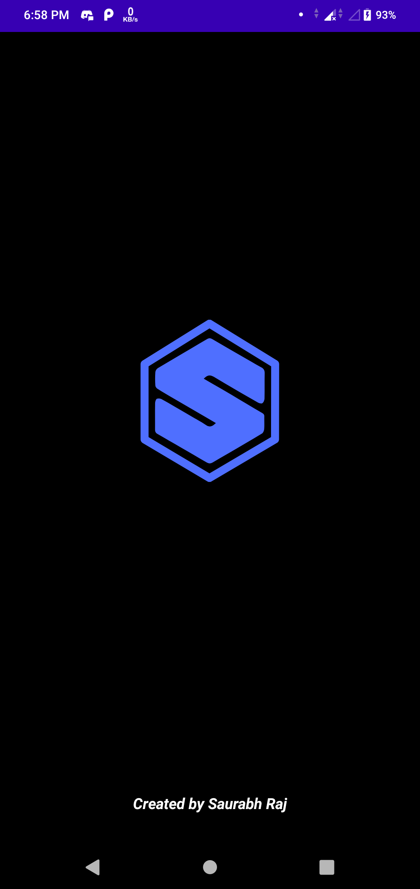
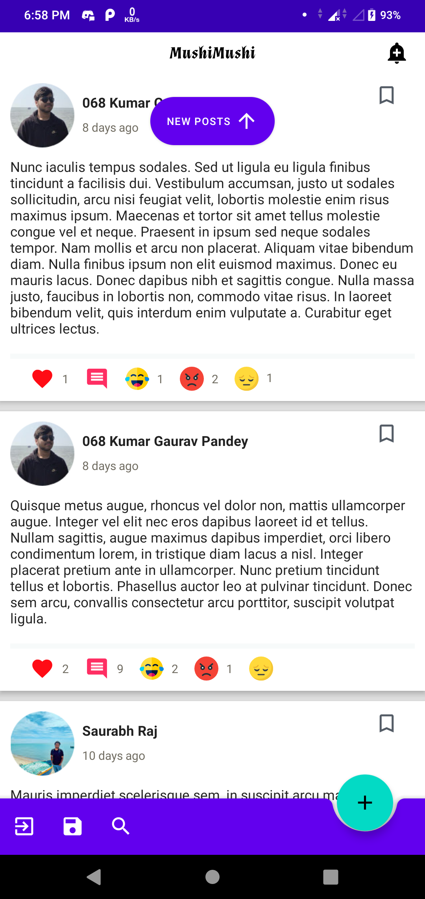
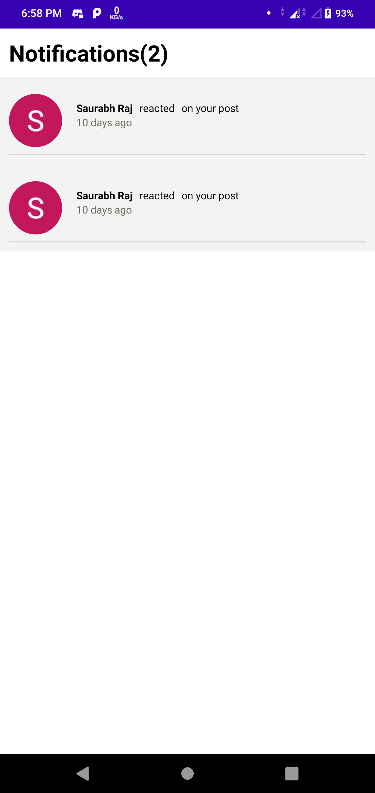
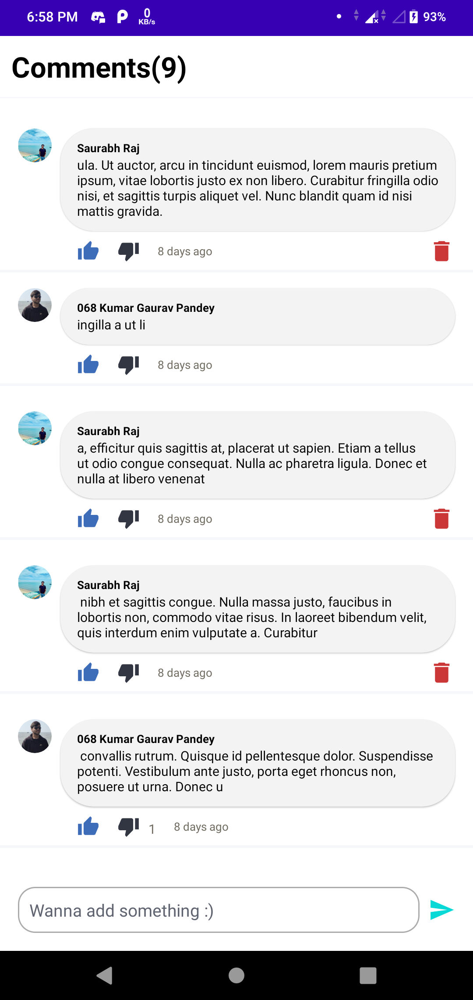
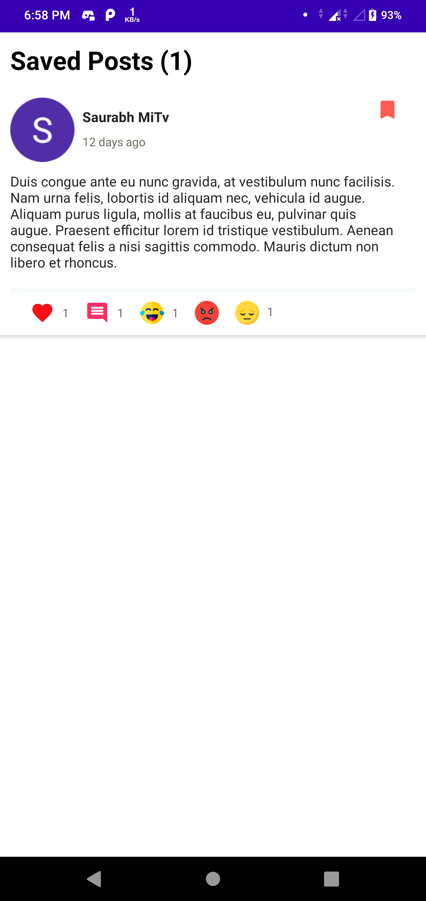
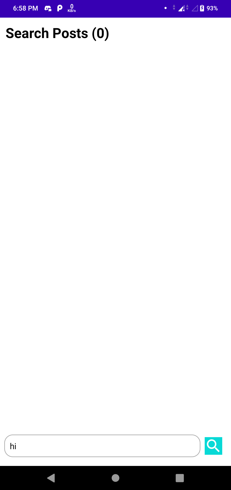
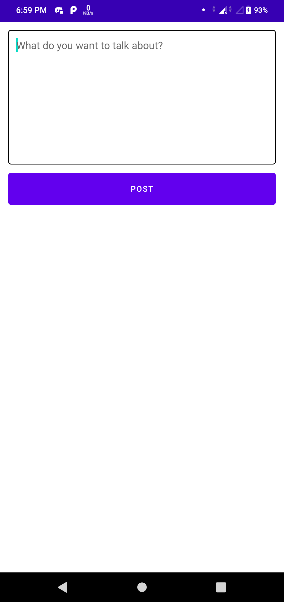

<p align="center"><a href="https://github.com/saurabhraj042/MushiMushi"></a></p> 
<h2 align="center"><b>Mushi-Mushi</b></h2> 
<p align="center">
<a href="https://github.com/saurabhraj042/MushiMushi" alt="GitHub release"></a>
<a href="/LICENSE" alt="License: GPLv3"></a>
<a href="https://github.com/saurabhraj042/MushiMushi" alt="Build Status"></a>
</p>
<hr>

## Screenshots

[](images/1.png)
[](images/2.png)
[](images/3.png)
[](images/4.png)
[](images/5.png)
[](images/6.png)
[](images/7.png)
[](images/8.png)


## Description

This application is a pattern of social components comprising posts, likes, reactions, comments, views, and others that can be used for Android application development. It is Firebase-based and uses such Firebase features as the firestore, and authentication.

### Features

* Search Posts
* Sign in with google and Create Posts
* Save posts of other users
* Working Notification Panel
* Comment Section for interaction on posts
* Delete posts/comments for everyone

### Coming Features

* User Profile tab
* Anonymous Posting ;)

### Technologies used
* Kotlin
* MVVM
* Firebase
* Android Architecture Components
* Glide


Setup steps
===========

 1. First of all you need google-services.json. Create a Firebase project in the [Firebase console](https://console.firebase.google.com/), if you don't already have one. Go to your project and click ‘Add Firebase to your Android app’. Follow the setup steps. At the end, you'll download a google-services.json file which you should add to your project.

 

 2. Setup Firestore database and ‘RULES’ like this:

 ```
 {
   "rules": {
     ".read": "true",
     ".write": "true"
   }
 }
 ```

 3. If you haven't yet specified your app's SHA-1 fingerprint, do so from the Settings page [Settings page](https://console.firebase.google.com/project/_/settings/general/) of the Firebase console. See [Authenticating Your Client](https://developers.google.com/android/guides/client-auth) for details on how to get your app's SHA-1 fingerprint.

 4. Enable the sign in method with google. 

 
    

 To have access to the demo version just email me @saurabhraj042@gmail.com :).

